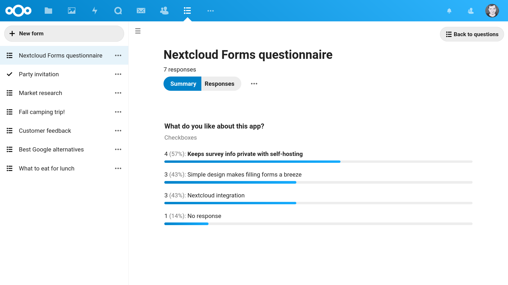

# Nextcloud Forms

**📝 Simple surveys and questionnaires, self-hosted**

### Straightforward form creation

### Simple sharing and responding

### Response visualization and exporting

- **📝 Simple design:** No mass of options, only the essentials. Works well on mobile of course.
- **📊 View & export results:** Results are visualized and can also be exported as CSV in the same format used by Google Forms.
- **🔒 Data under your control!** Unlike in Google Forms, Typeform, Doodle and others, the survey info and responses are kept private on your instance.
- **🙋 Get involved!** We have lots of stuff planned like more question types, collaboration on forms, [and much more](https://github.com/nextcloud/forms/milestones)!

## 🏗 Development setup

1. ☁ Clone this app into the `apps` folder of your Nextcloud: `git clone https://github.com/nextcloud/forms.git`
2. 👩‍💻 In the folder of the app, run the command `npm ci && npm run dev` to install dependencies and build the Javascript.
3. ✅ Enable the app through the app management of your Nextcloud
4. 🎉 Partytime! Help fix [some issues](https://github.com/nextcloud/forms/issues) and [review pull requests](https://github.com/nextcloud/forms/pulls) 👍

### 🧙 Advanced development stuff

To build the Javascript whenever you make changes, you can also use `npm run build`. Or `npm run watch` to automatically rebuild on every file save.

You run all tests by using `make test`.

## ♥ How to create a pull request

This guide will help you get started:
- 💃 [Opening a pull request](https://opensource.guide/how-to-contribute/#opening-a-pull-request)

## ✌ Code of conduct

The Nextcloud community has core values that are shared between all members during conferences, hackweeks and on all interactions in online platforms including [Github](https://github.com/nextcloud) and [forums](https://help.nextcloud.com). If you contribute, participate or interact with this community, please respect [our shared values](https://nextcloud.com/code-of-conduct/). 😌
